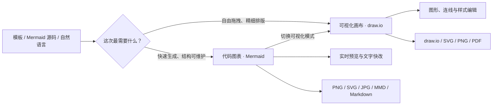
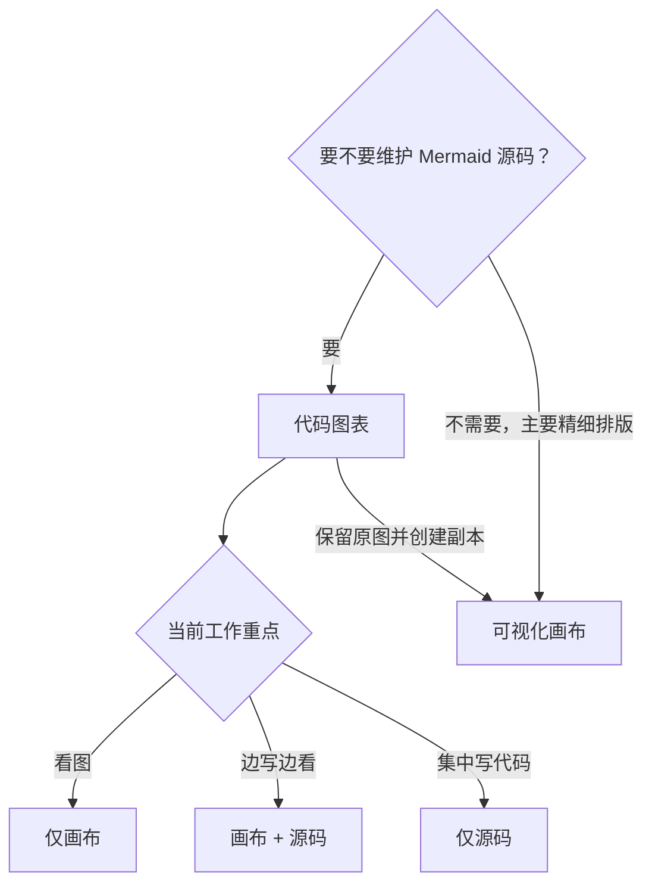
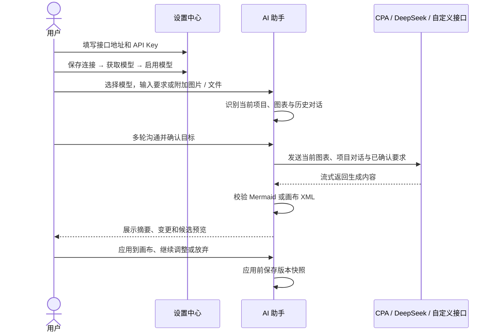
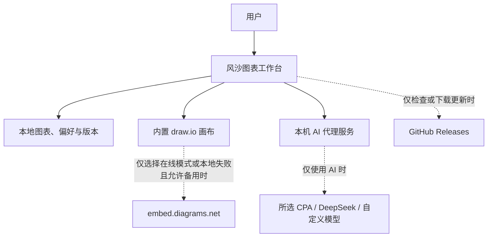

# 风沙图表工作台

> 面向中文工作场景的本地优先智能制图工具：既能像写文档一样快速生成 Mermaid 图，也能进入 Visio 式可视化画布做精细排版。

[](https://github.com/Fengsha5201314/Codebuddy_001_mermaid-markmap/releases/latest)


## 下载与开始使用

1. 打开 [GitHub Releases](https://github.com/Fengsha5201314/Codebuddy_001_mermaid-markmap/releases/latest)。
2. 下载名称类似 `Fengsha-Diagram-Setup-版本号-x64.exe` 的最新版安装程序。
3. 安装完成后，双击桌面的 **风沙图表工作台** 快捷方式即可使用，无需手动启动服务。
4. 后续在 **设置 → 版本与更新 → 检查更新** 中更新；下载完成后按提示重启安装。

> 当前正式桌面版支持 Windows x64。网页版代码保留在同一仓库中，可在本机开发，也可以部署到服务器。

## 它能做什么

- 使用模板、Mermaid 源码或自然语言 AI 快速生成流程图、泳道图、时序图、架构图等。
- 在实时预览中缩放、拖动画布，并双击普通节点文字直接修改；支持的修改会同步回 Mermaid 源码。
- 同一图表可在 Mermaid 源码画布和内置 draw.io 可视化画布之间切换，拖拽、连线、调整样式和排版。
- 使用 CPA AI、DeepSeek 或兼容接口进行生成、修改、修复和解释；结果流式显示，确认后才写入图表。
- 一个项目可包含主图和多级子图；项目目录、图表层级与两种画布关系会一起保存和备份。
- AI 支持项目级多轮对话，可附加图片、文本、数据和常见代码文件；先讨论确认，再生成候选图表。
- 自动保存本地图表，手动标记版本快照，备份或恢复完整工作区。
- 导出适合 Word、PPT、飞书、网页和归档的图片、源码或 PDF。



## 两种编辑方式，不必二选一

| 编辑方式 | 最适合 | 编辑特点 | 重要说明 |
|---|---|---|---|
| **代码图表（Mermaid）** | AI 生成、快速改结构、图表长期维护 | 左侧源码与右侧预览自动同步；预览中的普通文字可双击修改 | 适合先把逻辑做对，再快速迭代 |
| **可视化画布（draw.io）** | Visio 式拖拽、复杂排版、正式交付 | 自由移动图形、连线、双击文字、调整样式 | 转换时创建独立副本，不会覆盖原 Mermaid 图 |

Mermaid 源码和 draw.io XML 归属于同一项目中的同一张图，左侧只显示一个图表项，重复进入可视化画布也不会新建文件。一个项目还可以继续增加主图、子流程图、部门图或专题图，并以文件夹和树形层级组织。源码发生变化时，软件会先询问是否刷新可视化排版；AI 生成的 Mermaid 结构会同步回源码。纯手工坐标、样式和自由图形无法可靠还原为 Mermaid，因此只安全保存在可视化层。

### Mermaid 工作区的三个视图

| 视图 | 显示内容 | 推荐场景 |
|---|---|---|
| **仅画布** | 只显示 Mermaid 实时预览 | 演示、检查整体结构、专注看图 |
| **画布 + 源码** | 源码和实时预览并排 | 日常编辑，推荐默认使用 |
| **仅源码** | 只显示 Mermaid 编辑器 | 集中编写或粘贴大段源码 |

> 这里的“仅画布”是 Mermaid 的渲染预览；“可视化画布”则是可以自由拖拽图形的 draw.io 文档。



## AI 使用流程



任务模板只负责把专业提示词加入输入框，不会切换隐藏的操作模式；可在 **设置 → AI 指令模板** 中新增、修改、删除或恢复内置办公模板。AI 面板以连续对话为主：输入内容并点击 **发送** 完成讨论，形成共识后再通过独立操作栏点击 **生成候选**。Mermaid 候选会在中央画布预览，但不会覆盖当前图；校验和检查无误后点击 **应用到画布**。如果生成候选后当前图又被手工修改，软件会阻止直接应用并要求重新生成。右侧面板可拖动左边界调整宽度，双击边界恢复默认。具体配置见 [AI 模型接入说明](chart-visualizer/docs/ai-setup.md)。

## 本地、联网与隐私边界



- 图表、工作区偏好和版本快照默认保存在当前电脑；不会自动上传到项目仓库。
- 桌面版 API Key 保存在 Electron 应用数据目录的私有设置文件中，界面不会再次回显完整密钥。
- 使用 AI 时，当前图表内容、本项目本次对话和主动添加的附件会发送给所选模型服务，请不要提交不应交给该服务处理的敏感信息。
- 可视化画布默认使用安装包内置的 draw.io v31.1.8，断网可用。只有切换到官方在线引擎，或本地引擎失败且允许在线备用时，才会连接 `embed.diagrams.net`。
- 软件更新从本仓库的 GitHub Releases 获取，更新不会主动删除图表和配置；重要项目仍建议定期备份。

## 导入、导出与备份

| 当前文档 | 可导出格式 |
|---|---|
| Mermaid 代码图表 | PNG、SVG、JPG、MMD、Markdown |
| 可视化画布 | draw.io 源文件、SVG、PNG、PDF |

可视化画布导出的 SVG 会自动转换为原生 SVG 文字，避免 Windows 图片查看器只显示图形、不显示中文标签。

- 右上角 **导出交付**：导出当前图表。
- 右上角 **更多 → 导入**：导入 `.mmd`、`.mermaid`、`.md`、`.txt`、`.drawio`，或导入本工具生成的 JSON 工作区备份。
- **更多 → 备份** 或 **设置 → 数据与安全 → 下载完整备份**：下载包含全部图表和版本的 JSON 文件。
- 导入完整工作区会在确认后替换当前本地工作区；请先下载一次备份。
- `.drawio` 文件会经过结构与安全校验后作为新的可视化画布导入，也可以继续在 diagrams.net 中编辑。

## 文档

- [完整用户指南](chart-visualizer/docs/user-guide.md)：安装、模式选择、AI、导入导出、快捷键和故障排查。
- [AI 模型接入说明](chart-visualizer/docs/ai-setup.md)：CPA、DeepSeek 与兼容接口的配置步骤。
- [产品结构与数据流](chart-visualizer/docs/architecture.md)：桌面版、网页版、画布和 AI 的工作关系。
- [市场研究与产品路线](chart-visualizer/docs/market-research.md)：产品定位和后续能力规划。

## 网页版与本地开发

要求：Node.js 22+、pnpm 10+。

```bash
cd chart-visualizer
pnpm install --frozen-lockfile
pnpm dev
```

常用命令：

```bash
pnpm build              # 构建网页资源
pnpm preview            # 本地预览构建结果（包含 AI 服务）
pnpm test               # 单元与集成测试
pnpm test:e2e:visual    # 可视化画布桌面端到端测试
pnpm desktop:build      # 构建 Windows 安装包
```

网页版的图表数据保存在访问该网站的浏览器本地存储中。若部署为多人使用的公网服务，还需要额外设计账号、权限、服务端存储和密钥隔离；当前实现定位于本地单用户环境。仅把 `dist/` 当静态网站上传时不包含 AI 代理服务，AI 功能需要同时部署仓库中的服务端接口。

## 项目结构

```text
Codebuddy_001_mermaid-markmap/
├─ README.md                    # GitHub 项目首页
├─ .github/workflows/           # Windows 桌面版发布流程
└─ chart-visualizer/
   ├─ src/                      # React 工作台
   ├─ desktop/                  # Electron 桌面外壳与更新
   ├─ server/                   # 本机 AI 代理服务
   ├─ vendor/drawio/            # 固定版本的离线画布与上游许可
   ├─ docs/                     # 用户与产品文档
   └─ e2e/                      # 桌面画布端到端测试
```

## 已知限制

- 当前正式桌面安装包仅提供 Windows x64 版本。
- 自动更新和在线备用画布需要能够访问 GitHub 或 diagrams.net。
- AI 功能需要用户自行提供可用接口与 API Key，生成内容仍需人工确认。
- Mermaid 与可视化是同一图表的两种表现层；纯手工坐标和样式不会自动反向改写 Mermaid 源码。
- DeepSeek 当前只处理文字和代码，不接收图片；CPA / 自定义模型需在设置中明确开启“图片识别”。
- 当前不提供多人实时协作、云端项目同步或账号权限体系。

## 许可证与上游

项目内置画布基于 [jgraph/drawio](https://github.com/jgraph/drawio) 的固定版本构建。上游许可证与集成说明保留在 `chart-visualizer/vendor/drawio/` 中；本项目名称和“风沙”品牌不代表 draw.io 官方背书。
