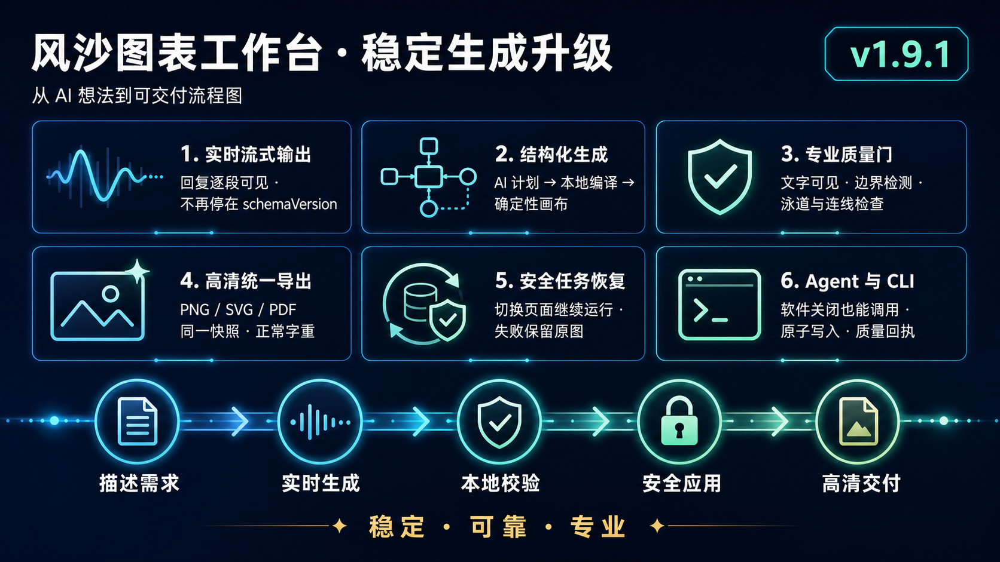

# 风沙图表工作台

本地优先的 Mermaid、AI 与 draw.io 可视化制图工具。桌面用户可以直接编辑和导出；自动化程序与其他 AI 工具可以使用 `fengsha-diagram` CLI 调用同一套渲染内核。


## 快速入口

- 普通用户：[桌面版用户指南](docs/user-guide.md)
- AI、脚本与自动化调用：[CLI 图文使用说明](docs/cli-guide.md)
- 系统维护人员：[产品结构与数据流](docs/architecture.md)
- 本次升级：[v1.9.1 实时流式输出与兼容性修复](docs/release-v1.9.1.md)



安装 v1.9.0 或更高版本后，在 PowerShell、CMD、Codex 或 Claude Code 中运行：

```powershell
fengsha-diagram version
fengsha-diagram visual-check process.mmd --quality professional --json
fengsha-diagram deliver process.mmd -o process.png --quality professional --receipt process.receipt.json --json
```

CLI 会复用桌面端的 Mermaid/draw.io 质量检查、中文标签修复、SVG 兼容处理和高清图片导出能力，返回可追溯哈希回执；不需要打开工作台窗口。
