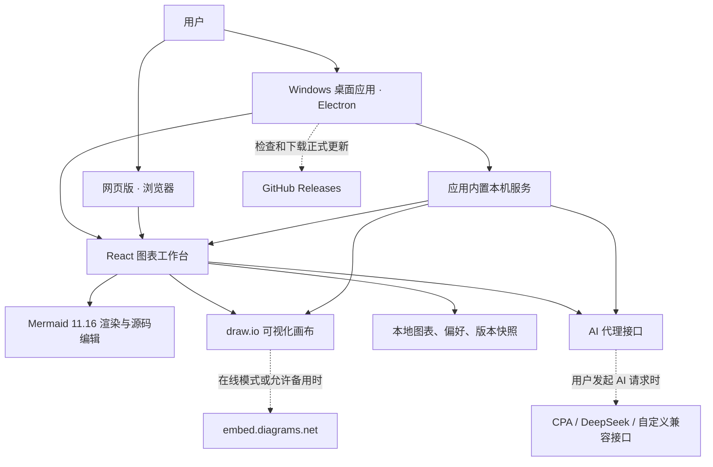
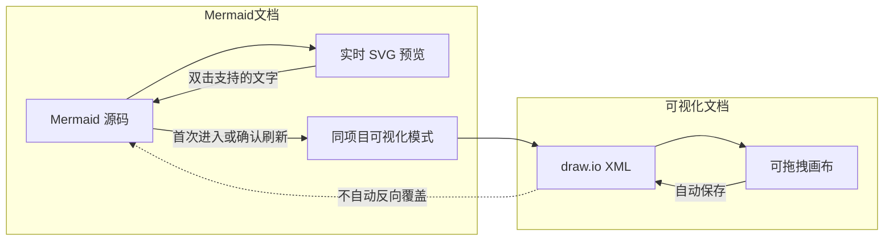
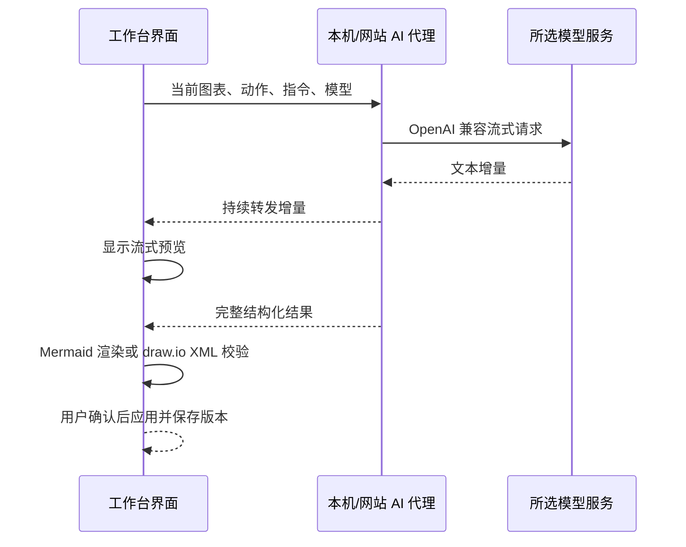
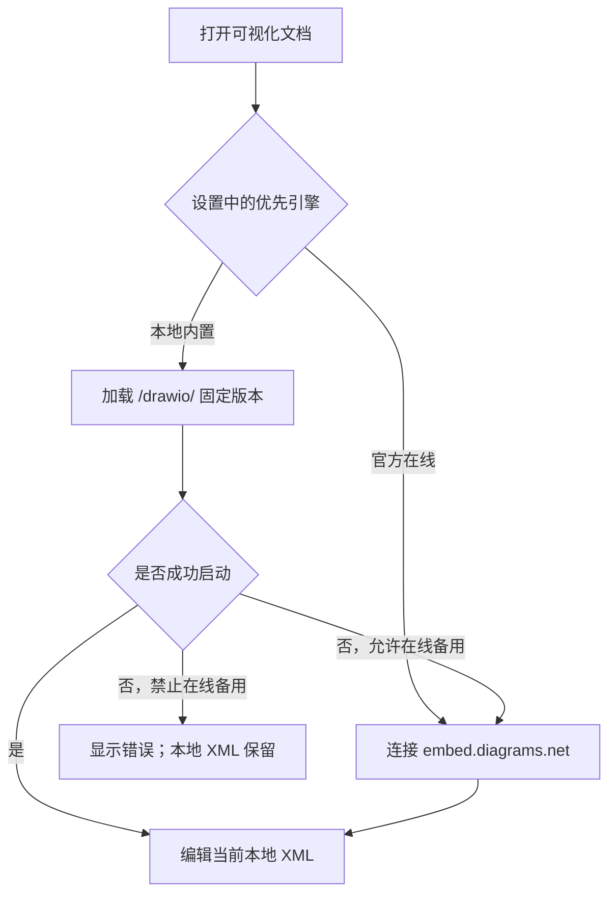
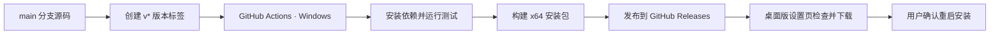

# 产品结构与数据流

这份说明用非程序员也能理解的方式解释：桌面版为什么无需启动服务、图表存在哪里、什么时候会联网，以及网页版与桌面版共用了哪些能力。

## 一张图看懂整体结构

## 桌面版为什么可以双击即用

桌面安装包同时带有界面、AI 代理接口和固定版本的 draw.io 资源。启动 Electron 后，应用会在本机回环地址上开启只供当前工作台使用的服务，再由桌面窗口加载。用户不需要安装 Node.js，也不需要打开终端运行项目。

桌面窗口启用了进程隔离、禁用网页直接使用 Node.js，并限制应用窗口跳转到非本地页面。外部网页链接交给系统浏览器打开。应用使用单实例锁，正常情况下重复双击快捷方式会聚焦已经打开的窗口，而不是启动两个独立实例。

## 两种图表数据模型

Mermaid 文档把源码作为事实来源，所以源码编辑、AI 修改和预览文字快改能够维护同一份文本。可视化文档把 draw.io XML 作为事实来源，所以图形位置、连接线和样式可以自由调整。

首次进入可视化画布时会创建一份关联的 XML 表示，之后重复进入会复用它，项目列表只展示一个根项目。AI 生成的 Mermaid 结构可同步回源码；复杂画布无法无损还原为所有 Mermaid 语法，因此纯坐标、样式和自由图形不会被强制反写。

## 数据保存位置与边界

| 数据 | Windows 桌面版 | 网页版 |
|---|---|---|
| 图表、偏好、版本 | Electron 用户数据中的浏览器本地存储 | 当前网站来源的浏览器本地存储 |
| API Key 和接口配置 | Electron 用户数据目录的 `ai-providers.json` | 运行 Vite/Node 服务的私有设置文件，默认 `.data/ai-providers.json` |
| 内置画布资源 | 安装包内的 `dist/drawio` | 由网站服务器提供 `/drawio/` 静态资源 |
| 完整备份 | 用户主动下载的 JSON 文件 | 用户主动下载的 JSON 文件 |

图表和偏好不会因为每次修改就上传到 GitHub。完整工作区备份包含图表和版本，但不包含 API Key。

网页版使用浏览器本地存储，因此域名、协议或端口变化都会形成新的独立存储空间。公网多人部署不能直接沿用当前单用户假设，应先增加身份认证、权限、服务端持久化和按用户隔离的密钥存储。

## AI 请求链路

前端不会读取已保存的完整 API Key。代理服务负责读取密钥、向模型添加认证头、限制请求和响应大小，并把流式结果转发给界面。用户点击停止或关闭请求时，代理会尝试取消上游请求。

需要明确的是：代理虽然避免密钥暴露在前端，但图表内容仍会发送到用户选择的第三方模型服务。是否适合发送某类业务数据，应遵循该模型服务的条款和用户所在组织的安全制度。

## 本地与在线 draw.io 引擎

内置资源来自 jgraph/drawio 的固定版本，随工作台安装和测试，不会在用户不知情时跟随上游变化。在线引擎只作为明确选择或本地失败时的可选备用。

## 更新与发布链路

发布流程会核对 Git 标签和 `package.json` 版本是否一致，再运行测试和构建。桌面端只接受正式版本更新，不自动安装预发布版本。更新过程不以删除用户数据为目标，但正式使用仍应保留定期备份制度。

## 网页部署需要什么

开发时执行 `pnpm dev`，本地开发服务器同时提供界面、内置画布和 AI API。`pnpm preview` 用于预览构建结果，也会挂载同样的 AI 接口。

生产环境不能只把 `dist/` 上传成纯静态站点后就假设 AI 可用：

1. `dist/` 包含前端和复制后的 draw.io 静态资源；
2. AI 设置、获取模型和流式请求需要仓库中的 Node 服务逻辑；
3. 公网环境需要 HTTPS、登录、权限、请求限流、日志脱敏和按用户隔离密钥；
4. 图表若仍保存在浏览器本地存储，换设备不会自动同步。

因此，当前最完整、最省心的使用方式是 Windows 桌面版；网页版保留为后续内网或云部署基础。

## 安全设计与仍需注意的风险

已经存在的保护包括：

- Electron 使用 `contextIsolation`、关闭 `nodeIntegration` 并开启渲染器沙箱；
- 外部页面不会在应用主窗口内自由跳转；
- AI Key 不通过状态接口回显到前端；
- 导入大小受限，工作区 JSON 会做结构校验；
- draw.io XML 会拒绝外部实体、脚本和危险事件属性；
- AI 输出应用前会做 Mermaid 渲染或 XML 结构检查；
- 版本标签发布前执行自动化测试。

用户和部署者仍应注意：

- 当前安装包没有在文档中承诺商业代码签名，下载时应核对 GitHub 发布来源和校验值；
- API Key 是本地私有文件，不等于操作系统级保险库，电脑账户和磁盘本身仍需保护；
- 自定义 API 地址由用户提供，使用前应确认服务可信；
- 公网网页版必须增加身份认证和按用户隔离，不能直接把当前本地单用户配置暴露给多人；
- AI 生成的业务流程和技术架构必须由人工复核。

## 关键目录

| 目录 | 用途 |
|---|---|
| `src/` | React 界面、图表状态、Mermaid 渲染和导出 |
| `desktop/` | Electron 窗口、本机服务、单实例和自动更新 |
| `server/` | AI 配置、模型列表和流式代理 |
| `vendor/drawio/` | 固定版本的 draw.io 资源、许可证和集成记录 |
| `e2e/` | 可视化画布的桌面端到端测试 |
| `.github/workflows/` | GitHub 标签触发的 Windows 发布流程 |

普通用户无需修改这些目录；实际操作请阅读 [完整用户指南](user-guide.md)。
