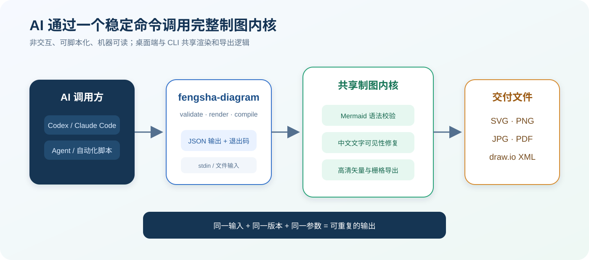
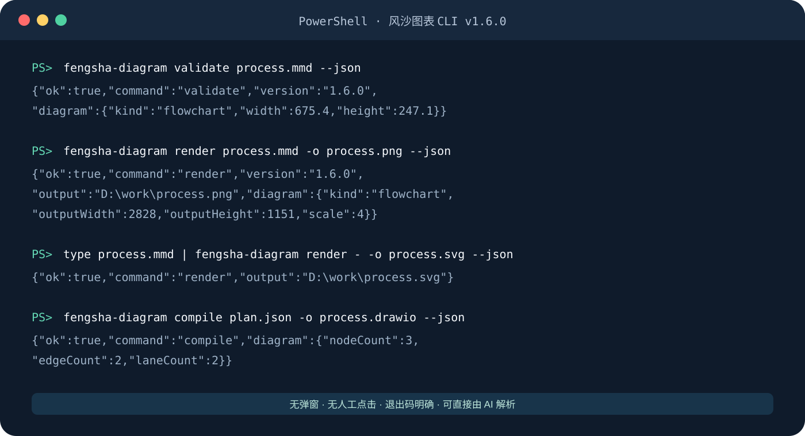
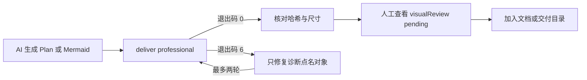

# 风沙图表 CLI 图文使用说明

`fengsha-diagram` 是风沙图表工作台 v1.9.0 的可靠交付入口。它适合 Codex、Claude Code、自建 Agent、CI 脚本和批量文档流程。调用方只需准备 Mermaid 源码、`fengsha.plan/v1` 或 draw.io XML，不需要模拟鼠标点击，也不需要让桌面窗口保持打开。



## 1. 安装后先确认命令

安装最新版 Windows 桌面程序后，重新打开 PowerShell 或 CMD，运行：

```powershell
fengsha-diagram version
```

正常结果：

```text
风沙图表 CLI v1.9.0
```

安装程序会把轻量命令入口放入当前 Windows 用户的命令搜索路径。CLI 本身随桌面程序安装，不需要额外安装 Node.js、Mermaid CLI 或浏览器。

> 如果当前终端是在安装前打开的，请关闭并重新打开终端。仍提示找不到命令时，可直接运行安装目录中的 `fengsha-diagram.cmd`。

## 2. 最常用的三个命令

### 只检查，不生成文件

```powershell
fengsha-diagram visual-check process.mmd --quality professional --json
```

检查会执行真实浏览器渲染，并返回稳定诊断码、问题对象、测量证据、可用修复方式和人工视觉状态。

### 生成高清 PNG

```powershell
fengsha-diagram deliver process.mmd -o process.png --quality professional --receipt process.receipt.json --json
```

PNG 默认使用智能高清模式，完整画布长边目标约 4800px，并受浏览器安全像素上限保护。也可以明确指定倍数：

```powershell
fengsha-diagram deliver process.mmd -o process.png --scale 3 --padding 32 --force --json
```

### 生成可编辑 draw.io

```powershell
fengsha-diagram compile plan.json --target drawio -o process.drawio --json
```

`compile` 接收严格的 `fengsha.plan/v1`，可确定性生成 Mermaid 或 draw.io，并检查节点、泳道、连线、重复 ID、引用、文字和几何布局。



## 3. 输入与输出

### 文件输入

```powershell
fengsha-diagram render D:\work\采购流程.mmd -o D:\work\采购流程.svg
```

### 标准输入

其他 AI 工具可以把生成结果直接通过管道交给 CLI，不必创建中间 Mermaid 文件：

```powershell
Get-Content -Raw process.mmd | fengsha-diagram render - -o process.svg --format svg --json
```

在 Bash 环境中：

```bash
cat process.mmd | fengsha-diagram render - -o process.svg --format svg --json
```

使用标准输入 `-` 时必须明确指定 `--output`，避免 AI 工具无法判断文件保存位置。

### 支持的输出格式

| 格式 | 用途 | 说明 |
|---|---|---|
| SVG | 网页、Office、矢量印刷 | 自动转为兼容的原生 SVG 文字，避免 Windows 查看器丢字 |
| PNG | PPT、Word、飞书、聊天工具 | 默认智能高清，保持完整画布 |
| JPG/JPEG | 更小的普通图片 | 透明背景会自动转为白色 |
| PDF | 审阅、归档、正式交付 | 根据图形宽高自动选择页面方向 |
| draw.io | 后续自由编辑 | 由结构化 JSON 计划通过 `compile` 生成 |

## 4. 参数速查

```text
fengsha-diagram validate <文件|-> [--theme paper] [--json]
fengsha-diagram render <文件|-> [-o 输出] [--format svg|png|jpg|pdf]
fengsha-diagram deliver <文件|-> [-o 输出] [--quality professional] [--receipt 回执.json]
fengsha-diagram visual-check <文件|-> [--quality professional] [--json]
fengsha-diagram compile <计划.json|-> [--target drawio|mermaid] [-o 输出]
```

| 参数 | 默认值 | 作用 |
|---|---:|---|
| `-o, --output` | 自动推导 | 指定输出文件；标准输入时必填 |
| `--format` | 根据扩展名 | `svg`、`png`、`jpg/jpeg`、`pdf` |
| `--theme` | `paper` | `paper`、`blueprint`、`executive`、`forest`、`midnight` |
| `--scale` | `auto` | PNG/JPG/PDF 倍率，范围 `0.1`～`4` |
| `--padding` | `32` | 四周留白，范围 `0`～`256` |
| `--background` | `white` | `white`、`transparent` 或 CSS 颜色 |
| `--quality` | `professional` | `professional` 阻止不合格交付；`standard` 将不确定项作为提示 |
| `--target` | `drawio` | `compile` 输出 `drawio` 或 `mermaid` |
| `--receipt` | 不另存 | 把完整质量回执写入指定 JSON 文件 |
| `--force` | 关闭 | 明确允许覆盖已有文件 |
| `--timeout` | `60` | 处理超时秒数，范围 `1`～`300` |
| `--json` | 关闭 | 只输出单行 JSON，推荐所有 AI 调用都开启 |

完整帮助：

```powershell
fengsha-diagram --help
```

## 5. 给其他 AI 工具的推荐调用规范

让 AI 始终遵循下面的顺序，可以显著减少失败结果进入文档：



可直接复制给 Codex 或 Claude Code 的任务说明：

```text
请把 Mermaid 源码保存为 process.mmd，然后运行：
fengsha-diagram deliver process.mmd -o process.png --quality professional --receipt process.receipt.json --json
解析最后一行 JSON，确认 ok=true、output 存在、receipt.acceptance=provisional 且哈希和尺寸存在。
退出码 6 时只修改 diagnostics.subject 点名的对象并使用 supportedFixes，最多修复两轮。
不要把 visualReview=pending 说成人工审美已经通过，也不要擅自增加 --force。
```

Node.js Agent 调用示例：

```javascript
import { spawn } from 'node:child_process'

const child = spawn('fengsha-diagram', [
  'deliver', 'process.mmd',
  '--output', 'process.png',
  '--quality', 'professional', '--receipt', 'process.receipt.json', '--json',
], { shell: true })

let output = ''
child.stdout.on('data', (chunk) => { output += chunk })
child.on('exit', (code) => {
  const result = JSON.parse(output.trim())
  if (code !== 0 || !result.ok) throw new Error(result.error?.message)
  console.log(result.output, result.diagram.outputWidth, result.diagram.outputHeight)
})
```

## 6. JSON 返回格式

成功示例：

```json
{"schemaVersion":"fengsha.cli/result/v1","ok":true,"command":"deliver","version":"1.9.0","input":"D:\\work\\process.mmd","output":"D:\\work\\process.png","diagram":{"outputWidth":4800,"outputHeight":1750},"receipt":{"acceptance":"provisional","inputSha256":"...","outputSha256":"...","visualReview":"pending","checks":[...]}}
```

失败示例：

```json
{"schemaVersion":"fengsha.cli/result/v1","ok":false,"command":"deliver","version":"1.9.0","error":{"category":"quality","message":"[layout/text-overflow] ..."}}
```

调用方应以进程退出码作为首要判断，以 JSON 中的 `ok`、`error.category` 和 `error.message` 作为修复依据。

## 7. 退出码

| 退出码 | 含义 | AI 应如何处理 |
|---:|---|---|
| `0` | 成功 | 读取 JSON 和输出文件 |
| `2` | 参数或防覆盖错误 | 修正命令；已有文件需要明确增加 `--force` |
| `3` | Mermaid/draw.io 校验失败 | 修改输入内容后重试 |
| `4` | 渲染或导出失败 | 降低清晰度、检查颜色参数或图形规模 |
| `5` | 文件读写失败 | 检查路径、权限和磁盘空间 |
| `6` | 专业质量检查拒绝 | 按诊断对象局部修复，最多重试两轮 |
| `7` | 流程要求人工视觉审查 | 请人或具备视觉能力的 Agent 查看成品 |
| `8` | 超时 | 缩小或拆分图表；确认进程已经结束后重试 |
| `10` | CLI 内部错误 | 保留版本、命令和错误信息并提交问题 |

## 8. `fengsha.plan/v1` 结构化计划示例

```json
{
  "schemaVersion": "fengsha.plan/v1",
  "diagramType": "workflow",
  "title": "采购审批流程",
  "direction": "LR",
  "lanes": [
    { "id": "business", "label": "业务部门" },
    { "id": "finance", "label": "财务部门" }
  ],
  "nodes": [
    { "id": "start", "type": "start", "label": "提出申请", "lane": "business", "column": 0 },
    { "id": "review", "type": "decision", "label": "预算充足？", "lane": "finance", "column": 1 },
    { "id": "finish", "type": "end", "label": "审批完成", "lane": "business", "column": 2 }
  ],
  "edges": [
    { "id": "e1", "source": "start", "target": "review", "kind": "normal" },
    { "id": "e2", "source": "review", "target": "finish", "label": "通过", "kind": "yes" }
  ]
}
```

节点类型支持：`start`、`end`、`process`、`decision`、`document`、`data`、`system`、`manual`、`note`。

## 9. 稳定性与安全约束

- CLI 默认不覆盖已有文件；只有明确传入 `--force` 才允许覆盖。
- 覆盖时先备份旧成品、校验新文件哈希，再原子替换；任一步失败都会恢复旧文件。
- 输入上限为 5 MB，避免模型意外提交超大内容拖垮进程。
- 每次调用使用独立临时浏览器配置，不会读取或改写桌面工作区、图表和 AI Key。
- CLI 不调用大模型，也不会把图表内容上传到网络；Mermaid 渲染和导出均在本机完成。
- 隐藏渲染窗口启用 `contextIsolation`、关闭 Node.js 页面权限，并使用独立的本机随机端口。
- SVG、PNG 和 PDF 使用桌面端相同的文字兼容与导出逻辑，避免两套实现长期漂移。

## 10. 给 Codex / Claude Code 安装 Agent Skill

安装包中包含 `agent-skills\fengsha-diagram`。把整个文件夹复制到 Agent 的 skills 目录即可；项目源码中的位置是 `agent-skills/fengsha-diagram`。Skill 会要求 Agent 优先使用 `deliver --quality professional --json`，根据稳定诊断做最多两轮局部修复，并诚实保留 `visualReview: pending`。


## 11. 源码开发环境调用

在项目目录中：

```powershell
pnpm install
pnpm build
pnpm cli -- version
pnpm cli -- render e2e/fixtures/cli-process.mmd -o output/process.svg --json --force
```

CLI 端到端测试：

```powershell
pnpm test:e2e:cli
```

该测试会真实验证版本、校验、SVG、高清 PNG、PDF、draw.io、标准输入、非法语法退出码和防误覆盖行为。
