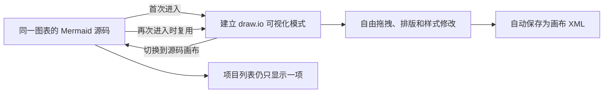

# 风沙图表工作台用户指南

这份指南面向第一次使用的用户，不要求了解编程。最简单的工作方式是：从模板开始，先在“画布 + 源码”中把业务逻辑做对，需要精细排版时再进入同一项目的可视化画布，最后导出交付。

## 1. 安装、启动与更新

### 安装桌面版

1. 在项目的 [Releases 页面](https://github.com/Fengsha5201314/Codebuddy_001_mermaid-markmap/releases/latest) 下载最新的 `Fengsha-Diagram-Setup-版本号-x64.exe`。
2. 运行安装程序并选择安装位置。
3. 安装程序会创建“风沙图表工作台”桌面快捷方式和开始菜单入口。
4. 以后直接双击桌面快捷方式使用，不需要打开命令窗口，也不需要手动启动网页服务。

如果 Windows 显示来源提醒，请先确认文件确实来自上述 GitHub Releases 页面，再按组织的安全规范决定是否运行。重要版本的文件校验值以 Release 说明为准。

### 查看版本和更新

打开 **设置 → 版本与更新**：

1. 页面右侧显示当前版本号。
2. 点击 **检查更新**。
3. 有新版本时，软件会下载正式安装包并显示进度。
4. 下载完成后点击 **立即重启并安装**。

更新不会主动删除图表、版本快照和 AI 配置。为了避免硬盘损坏、系统重装等意外，建议重要项目定期执行 **设置 → 数据与安全 → 下载完整备份**。

从 v1.5.0 开始，安装版与桌面开发预览统一使用同一个持久化身份，并固定复用本地访问来源。重新编译、重启或覆盖升级后，API Key、已启用模型、图表和工作区偏好应继续保留；旧开发目录中的 AI 配置只会在正式目录为空时迁移，不会覆盖现有配置。

> 网页开发预览中不能使用桌面自动更新按钮；请在已经安装的正式桌面版中检查更新。

## 2. 认识主界面

| 区域 | 主要作用 |
|---|---|
| 左侧项目栏 | 新建、搜索、切换、收藏、复制或删除本地图表 |
| 顶部视图栏 | 在“仅画布”“画布 + 源码”“仅源码”之间切换 |
| 中央工作区 | 编辑 Mermaid 源码、查看实时预览，或操作可视化画布 |
| 右侧工具面板 | AI、主题样式、常用组件和版本快照 |
| 右上角操作区 | 可视化画布、设置、导入、备份、快捷键和导出 |

左下角出现“数据仅保存在本机”表示当前图表正在本地自动保存。自动保存负责防止日常修改丢失，版本快照则用于标记“可以回退的关键节点”，两者不是同一件事。

右侧工具面板可以拖动左边界调整宽度，双击边界恢复默认宽度。软件会根据窗口和当前视图限制最大宽度，避免工具面板把中央画布挤到无法操作。

### 建议的第一次操作

1. 点击左侧 **从模板新建**。
2. 选择 **代码图表**，再选择一个接近业务的模板。
3. 在源码区把节点名称改成自己的业务术语。
4. 在预览区检查连接关系；需要时双击节点文字快速修改。
5. 点击右上角 **导出交付**，先导出一张 PNG 试用。

## 3. 代码图表与可视化画布的区别

### 代码图表（Mermaid）

适合快速生成和长期维护结构。修改源码后，预览会自动重新绘制；在实时预览中双击普通节点或连线文字，也可以修改对应源码。

以下内容通常仍应在源码或“组件”面板中修改：

- 结构名称、部分自动生成的标题；
- 节点形状、连线方向和分组关系；
- 一段文字在源码中出现多次、需要明确选择位置时；
- 当前源码有语法错误时。

### 可视化画布（draw.io）

适合自由拖动、精细排版和正式交付。可以直接选择图形和连线、双击文字、删除对象、撤销或重做。画布修改会自动保存在当前可视化文档中。

### 进入可视化画布时发生了什么

Mermaid 源码和 draw.io XML 是同一项目下的两种表示。源码修改后再次进入可视化画布，软件会询问是否用最新源码刷新，避免静默覆盖手工排版；画布 AI 若生成可还原的 Mermaid 结构，会同步回源码。纯手工位置和自由图形无法可靠翻译成 Mermaid，因此只保存在可视化层。

## 4. 三种 Mermaid 工作区视图

### 仅画布

只显示 Mermaid 实时预览，适合演示、检查整体结构或隐藏代码区。需要继续写源码时，切换到“画布 + 源码”，或使用预览区提供的显示源码入口。

### 画布 + 源码

源码和预览并排，是推荐的默认视图。可拖动中间分隔条调整宽度，双击分隔条恢复默认比例。

### 仅源码

只显示 Mermaid 编辑器，适合粘贴和集中整理大段代码。图表仍会自动保存，切回其他视图后会重新显示预览。

> “仅画布”是 Mermaid 的渲染预览，不等于能够自由拖拽图形的“可视化画布”。

## 5. 缩放、拖动与直接编辑

### Mermaid 实时预览

- 滚动鼠标滚轮：以鼠标位置为中心缩放。
- 拖动画布空白处：平移图表。
- 点击 `+`、`−`：逐级放大或缩小。
- 点击适应按钮，或焦点不在输入框时按 `F`：让图表适应当前区域。
- 双击普通文字：打开文字编辑框；保存后同步到对应源码行。

预览缩放范围足以查看超大图，但交付前仍建议减少过长连线和过密节点，让读者无需极端缩放也能阅读。

### 可视化画布

- 双击文字进行编辑。
- 拖动画布移动视野；选择对象后可移动、连接或改变样式。
- `Delete` 删除选中的对象。
- `Ctrl + Z` 撤销，`Ctrl + Shift + Z` 重做。
- 顶部 **适应画布** 用于快速找回图表位置。

## 6. 配置并使用 AI

当前支持 CPA AI、DeepSeek，以及 OpenAI 接口格式兼容的自定义服务。详细接口说明见 [AI 模型接入说明](ai-setup.md)。

### 首次配置

1. 打开 **设置 → AI 模型**。
2. 在选定服务中填写接口根地址和 API Key。
3. 接口地址只填写根地址，不要自行追加 `/models` 或 `/chat/completions`。
4. 点击 **保存连接**。
5. 点击 **获取模型**。
6. 从下拉框选择模型并点击 **启用模型**。
7. 可在“对话可选模型”区域选择默认模型。

### 项目目录与子图

左侧“本地项目”现在按项目文件夹组织。每个项目可包含一张主图和多级子图，例如“总流程 → 财务审批 → 异常处理”。点击项目行的 `+` 会在当前图下新增子图；没有选中项目内图表时则新增项目根图。Mermaid 与可视化画布是同一图表的两种表现层，不会因为重复进入可视化画布而不断创建文件。

### 多轮沟通并生成图表

1. 打开右上角 **AI 助手**。
2. 在底部输入区选择已启用模型。需要更大的阅读空间时，可拖动面板左边界调整宽度。
3. 直接输入要求，或者在空白对话中选择任务模板；已有对话时可从底部 **快捷任务** 打开模板菜单。
4. 在模板内容后补充具体要求，例如“保留现有泳道，在付款前增加财务复核，驳回后返回申请人补充资料”。
5. 确认输入框上方显示“已识别当前 Mermaid 源码”或“已识别当前可视化画布”；当前页面无内容时会明确提示将创建新图。
6. 点击 **发送** 与 AI 讨论。AI 会基于当前图和该项目的历史对话归纳目标、指出关键问题，不会直接改图；可继续发送多轮消息，长对话会在同一时间线内滚动显示。
7. 方向确认后，在对话与输入区之间的操作栏点击 **生成候选**。内容会流式出现，也可以点击 **停止**。
8. 等待结构或渲染校验完成，检查摘要和变更列表。Mermaid 候选会同时显示在中央画布，可用 **返回当前图** 切回原图。
9. 点击 **应用到画布**；也可以继续发送调整意见、重新生成或放弃候选。应用前，当前图始终保持不变。

对话记录按项目保存，每段对话最多保留最近 120 条消息。可在对话顶部开始新对话或切换历史记录；同一项目的 Mermaid 和可视化画布共享这些对话。发送给模型时，软件会保留最初目标，并按长度选取最近上下文，避免长对话无限增大请求。通过“添加图片 / 文件”可提交图片、文本、Markdown、CSV、JSON、XML、Mermaid 和常见代码文件。DeepSeek 不支持图片；CPA / 自定义模型需先在设置中为具体模型开启“图片识别”。音频和视频不会被接收。

### 管理专业指令模板

打开 **设置 → AI 指令模板**，可以新增、修改、删除常用办公指令，也可以恢复内置模板。模板只是把专业提示词加入输入框，仍可继续补充业务背景，不会立即调用模型或覆盖图表。

应用到画布前，软件会保存“AI 修改前”版本快照。Mermaid AI 结果通过渲染检查后才允许应用；可视化 AI 结果会检查画布 XML 结构。候选生成后如果当前源码或画布又发生变化，软件会阻止直接覆盖并要求重新生成候选。

### AI 隐私提示

软件只把当前图表、当前项目所选对话和你主动添加的附件交给所选服务，不会主动读取其他项目、旧版本或本机其他文件。但是这些内容会经过对应模型提供商处理，因此不要发送密码、密钥、个人敏感数据或未经授权的内部资料。

## 7. 版本、自动保存与完整备份

### 自动保存

源码、画布和常用偏好在修改时自动保存到本机。关闭并重新打开软件后，通常会回到上次的本地工作区。

### 版本快照

打开 **AI 与工具面板 → 版本**：

- 点击 **存新版本** 标记当前状态；
- 每个图表最多保留 30 个手动快照；
- 恢复旧版本前，建议先为当前状态存一个新版本；
- AI 确认应用前会自动创建快照。

### 完整备份

通过 **更多 → 备份**，或者 **设置 → 数据与安全 → 下载完整备份**，可下载一个 JSON 文件，其中包含项目目录、全部图表及版本。

恢复时选择 **更多 → 导入** 并选中这个 JSON 文件。软件会显示图表数量，只有确认后才替换当前工作区。恢复前建议先把当前工作区再备份一次。

## 8. 导入与导出

### 可以导入什么

- Mermaid 文件：`.mmd`、`.mermaid`；
- 含 Mermaid 代码块的 Markdown：`.md`；
- 纯文本 Mermaid：`.txt`；
- 风沙工作区完整备份：`.json`。

单个导入文件最大 10 MB。JSON 工作区恢复是整体替换，不是把项目追加到当前列表。

主界面可以直接导入 `.drawio` 文件。文件会经过结构与安全校验，再创建为新的可视化画布；导出的 `.drawio` 文件也可以在 diagrams.net 中继续编辑。

### Mermaid 图表导出

| 格式 | 建议用途 |
|---|---|
| PNG | Word、PPT、飞书、即时通讯，默认 2 倍高清 |
| SVG | 矢量文档、网页、高清印刷 |
| JPG | 文件体积较小、不需要透明背景的图片 |
| MMD | 保存和交付 Mermaid 源码 |
| Markdown | 粘贴到支持 Mermaid 的文档或代码仓库 |

图片导出可选择 1–4 倍清晰度、留白和背景色。图表有语法错误时，请先修复后再导出图片；MMD 和 Markdown 仍可用于带走源码。

### 可视化画布导出

| 格式 | 建议用途 |
|---|---|
| draw.io | 保留图形、连接线、样式和页面结构，适合长期保存 |
| SVG | 矢量文档和印刷 |
| PNG | 办公软件和聊天工具 |
| PDF | 审阅、归档和正式交付 |

可视化画布的 SVG 在下载前会自动移除仅部分浏览器支持的 HTML 文字层，并保留原生 SVG 文字。这样在 Windows 图片查看器、浏览器和常见文档软件中都能看到中文标签。

## 9. 本地画布和官方在线画布

打开 **设置 → 画布引擎**：

- **本地内置**：推荐。使用随软件安装的 draw.io v31.1.8，不依赖官方网站，断网可打开。
- **官方在线**：需要访问 `embed.diagrams.net`，主要用于临时排查本地引擎问题。
- **本地异常时自动使用在线备用**：开启后，本地画布启动失败才连接官方在线服务；关闭后不会自动联网备用。

切换画布引擎会重新载入当前可视化文档，但画布 XML 仍保存在本机。内置引擎不会跟随上游自动变化，而是随经过测试的工作台正式版本更新。

## 10. 桌面版与网页版

| 项目 | Windows 桌面版 | 网页版 |
|---|---|---|
| 启动 | 双击快捷方式，无需手动启动服务 | 需要访问已运行或已部署的网站 |
| 图表存储 | 桌面应用数据目录 | 当前网址对应的浏览器本地存储 |
| API Key | 桌面应用私有设置文件 | 运行网站的服务端设置文件 |
| 更新 | 设置中检查、下载并安装 | 由网站部署者更新 |
| 适用场景 | 单机日常使用，推荐 | 内网或云端部署、跨设备访问 |

当前网页版仍按本地单用户方式设计。如果把它公开给多人使用，需要先增加账号登录、访问权限、独立的服务端数据存储和按用户隔离的 API Key。静态 `dist/` 不包含 AI 代理服务，部署 AI 功能时必须同时提供服务端接口。

## 11. 快捷键

| 操作 | 快捷键 |
|---|---|
| 新建图表 | `N` |
| 打开模板中心 | `Ctrl + K` |
| 保存版本快照 | `Ctrl + S` |
| 导出成果 | `Ctrl + Shift + E` |
| 编辑器内搜索 | `Ctrl + F` |
| 适应 Mermaid 预览 | `F` |
| 预览缩放 | 鼠标滚轮；应用内快捷键说明显示为 `Ctrl + 滚轮` |
| 关闭弹窗和工具面板 | `Esc` |
| 可视化画布撤销 | `Ctrl + Z` |
| 可视化画布重做 | `Ctrl + Shift + Z` |
| 可视化画布删除所选 | `Delete` |
| AI 输入框提交 | `Ctrl + Enter` |

macOS 形式的 `⌘` 提示是网页版组件的通用显示；当前正式桌面安装包只发布 Windows x64。

## 12. 常见问题排查

### 可视化画布一直显示正在连接

1. 打开 **设置 → 画布引擎**，确认优先方式为“本地内置”。
2. 等待本地组件首次加载完成；不要连续创建多个画布。
3. 关闭并重新打开工作台。
4. 若网络可用，可临时开启“本地异常时自动使用在线备用”。
5. 仍无法打开时，先导出完整工作区备份，再记录软件版本和错误提示提交 Issue。

本地或在线画布加载失败不会自动删除已保存的画布 XML。

### AI 助手提示未配置或获取不到模型

1. 检查接口根地址是否正确，末尾不要包含 `/models` 或 `/chat/completions`。
2. 重新填写 API Key 并点击“保存连接”。
3. 确认网络、代理和防火墙允许访问对应模型服务。
4. 点击“获取模型”，启用至少一个模型，并在 AI 助手的“本次使用”中选择它。
5. 如果服务返回无权限或余额不足，需要在该服务侧处理账号问题。

### 双击预览文字却不能修改

这段文字可能是结构名称、自动生成内容，或者源码中存在多个相同文本。请切换到“画布 + 源码”，在源码或右侧“组件”面板中修改。如果当前 Mermaid 有语法错误，也需要先修复错误。

### 可视化画布修改后，哪些内容会同步到 Mermaid

AI 生成或修改且带有 Mermaid 结构时，会同步回同一项目源码。纯手工拖拽、坐标、样式或 draw.io 自由图形不会被强行反写，因为这会制造错误源码；这些内容会安全保存在可视化 XML 中。点击顶部 **源码画布** 可以随时切回。

### 导出图片失败或内容不完整

1. 先点击适应画布并确认图表本身显示完整。
2. Mermaid 图有语法问题时先修复，再导出图片。
3. 超大图优先使用 SVG，或降低 PNG 清晰度后重试。
4. 可视化画布先保存一份 `.drawio` 源文件，再尝试图片或 PDF。
5. 如果旧版本导出的可视化 SVG 只有图形没有文字，请用最新版重新导出；旧文件中的文字通常未丢失，而是查看器无法显示其中的 HTML 文字层。

### 检查不到更新

- 确认使用的是已安装的正式桌面版，而不是开发预览或网页版；
- 确认能访问本项目 GitHub Releases；
- 打开 Releases 页面核对是否确实存在比当前版本更高的正式版本；
- 仍有问题时可以手动下载最新安装程序覆盖安装，图表数据通常会保留，但建议先备份。

### 网页版更换网址或清理浏览器后图表不见了

网页版数据属于当前网站地址的浏览器本地存储。更换域名、端口、浏览器或清理站点数据后，原数据不会自动迁移。请在迁移前下载完整备份，并在新地址导入。

## 13. 提交问题时请提供

- 软件版本（设置 → 版本与更新）；
- Windows 版本；
- 当前是 Mermaid 代码图表还是可视化画布；
- 可复现的操作步骤和错误提示截图；
- 是否断网、是否启用了官方在线备用；
- AI 问题请提供服务名称和 HTTP 错误，不要提供完整 API Key；
- 如需提供示例图，请先移除业务秘密和个人信息。
